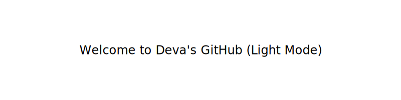

  <picture>
    <source srcset="assets/banner-dark.svg" media="(prefers-color-scheme: dark)">
    <source srcset="assets/banner-light.svg" media="(prefers-color-scheme: light)">
    
  </picture>

  

  
  
  

---

### 🧠 About Me

> *"I don’t search for tools — I build them."*  
> 🔍 *"Packet captures are poetry."*

- 👋 Hey! I'm Deva — a detail-obsessed **VoIP engineer** blending legacy telephony with modern AI scripting.  
- ⚙️ From SIP traces to Asterisk dialplans, I live in the intersection of **communication tech** and **automation**.  
- 🤖 Currently exploring how to embed **AI copilots** into **real-time comms** platforms.  
- 🌱 Forever learning. Forever tinkering. Forever automating.

---

### 🛠️ Tech Stack I Love

  
  
  
  
  
  

---

### 🎯 Fun Projects & Experiments

- 🧠 **AI-Powered Scripts** – Creating personal copilots to streamline work and life  
- 🎛️ **Self-hosted Dashboards** – Python + Streamlit + APIs = pure magic  
- 📞 **Call Debugging Toolkit** – Wireshark meets automation  
- 🎙️ **Voice Bots & IVRs** – Tinkering with NLP + Asterisk  

---

### ✨ Vibes & Passions

- 💬 Turning cryptic SIP logs into symphonies of clarity  
- 🧰 Building tools that simplify workflows  
- 🌐 Exploring the elegance of CLI  
- 🔄 Automating the automatable  
- 🌙 Switching between light/dark mode like a theme DJ  

---

### 📊 GitHub Stats

  
  

---

### 🧬 Life in a SIP Packet

💼 <strong>Professional Timeline</strong>

#### 🟢 Movate  
`Associate Solution Delivery Consultant` (May 2025 – Present)  
- Led 8x8 UCaaS and CCaaS onboarding  
- Created IVRs and knowledge portals  
- Handled enterprise escalations with flair  

#### 🟠 Brillio Technologies  
`Senior Engineer` (Aug 2023 – Jul 2024)  
- Asterisk configs, IPTables, SIP tracing wizardry  
- Custom dialplans and monitoring built from scratch  

#### 🔵 RCS Tech LLP – Byju’s  
`Senior Engineer & UC Engineer` (Apr 2021 – Aug 2023)  
- Orchestrated Knowlarity + Ameyo platforms  
- Built IVR bots and integrated CRMs  
- Zabbix-powered infrastructure monitoring  

---

🎓 <strong>Education</strong>

- 🎓 **B.Tech (IT)** – IFET College of Engineering  
  Built *YFarm* Android app, interned at NCR Corp  

- 📘 **HSC** – St. Paul’s MHSS (81.5%)  
- 📗 **SSLC** – S.K.V HSS (89.4%)

---

### ✨ Bonus Animation

  
  

  🌗 <strong>View README in Dark/Light Mode</strong> 👉 <a href="https://d3va.pages.dev/readme-preview">Live Preview</a>

  

